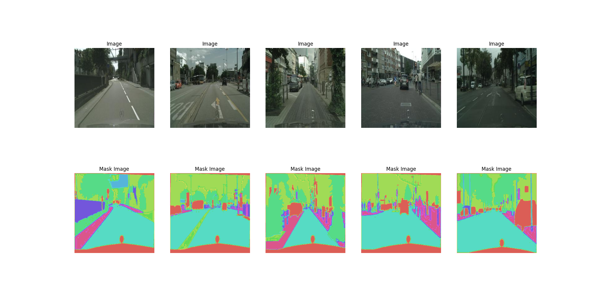

## Cityscapes

Cityscapes is a large-scale database which focuses on semantic understanding of urban street scenes. It provides semantic, instance-wise, and dense pixel annotations for 30 classes grouped into 8 categories (flat surfaces, humans, vehicles, constructions, objects, nature, sky, and void). The dataset consists of around 5000 fine annotated images and 20000 coarse annotated ones. Data was captured in 50 cities during several months, daytimes, and good weather conditions. It was originally recorded as video so the frames were manually selected to have the following features: large number of dynamic objects, varying scene layout, and varying background.

### Example of image and masks

## Learned on this dataset

Learned to use bins in order to change the classic image form [256,256,3] to [256,256,n_class] with the n_class = 13.
Used bins in order to attribute a class to each pixel.
Used multiple_gpu to train the model.

## Results achieved
